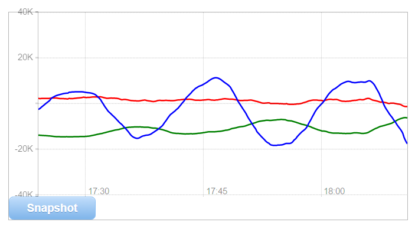
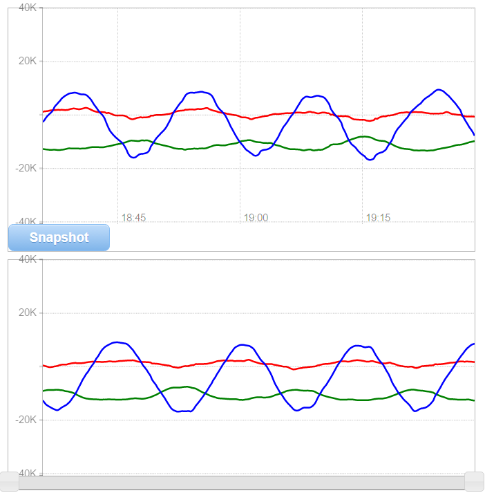
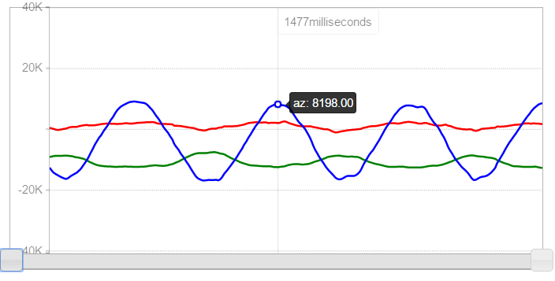
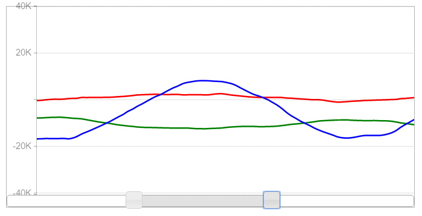

# SerIOGrapher

read streaming serial data (from an arduino for instance) and plot it on a moving graph in your browser. 


Uses [Rickshaw](https://github.com/shutterstock/rickshaw), socket.io, socket.io-serialport


## Installation

Git clone or download/extract zip

```bash
cd SerIOGrapher
npm install command-line-args serialport socket.io socket.io-serialport
```

## Usage

### List serial port(s) info

```bash
node acc_serial_socket.js -l
```

### Run serial socket server

default port is `COM3` (windows*)

```bash
node acc_serial_socket.js
```

specifying a different port number

```bash
node acc_serial_socket.js -p 2
```

(* linux/Mac users will need to manually change the `COM#` references in `acc_serial_socket.js` and `public/acc_graph.html` to `/dev/tty#` or whatever is appropriate for their system)


### Run graph webpage

open public/acc_graph.html in your browser of choice to see the data rendered. (tested on Chrome 55.0.2883.87 m 64-bit)



Click Snapshot to duplicate a frozen copy of the current graph window.



Trace over the snapshot with your cursor to see data values.



Use the slider to zoom in on the relevant data.

